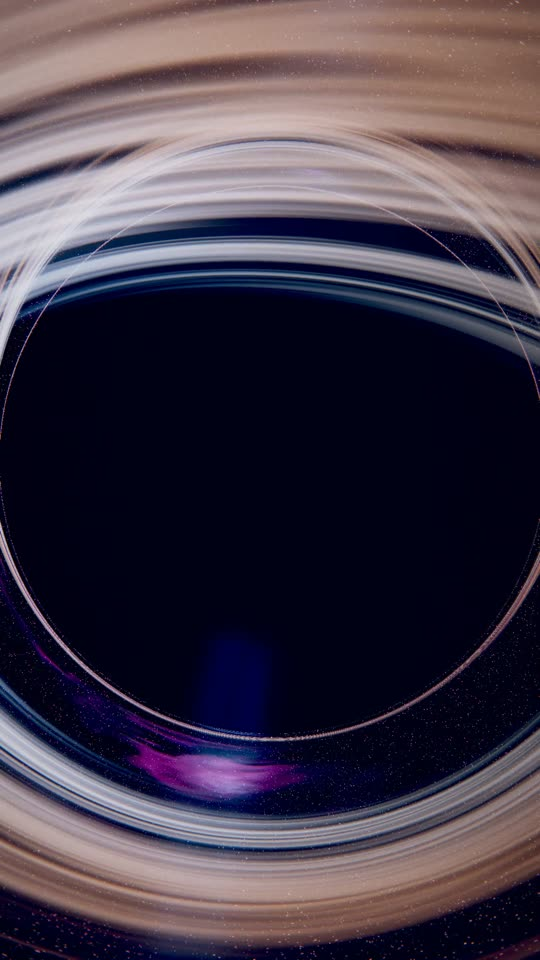
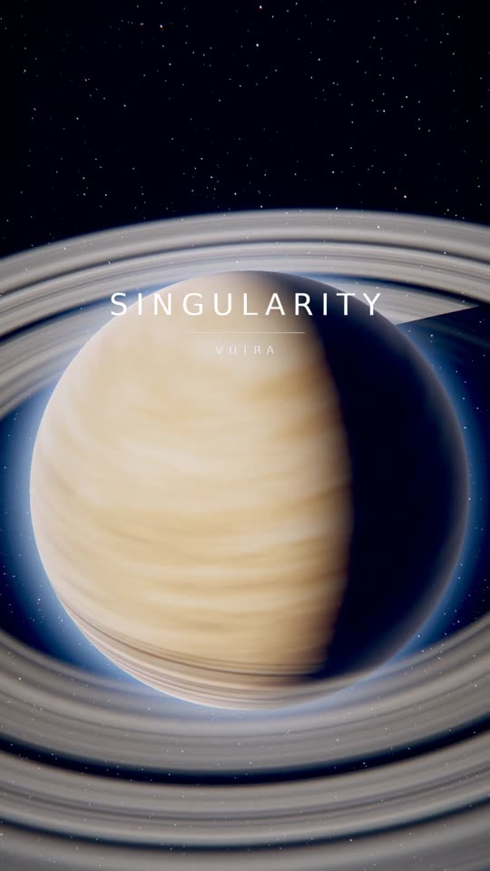
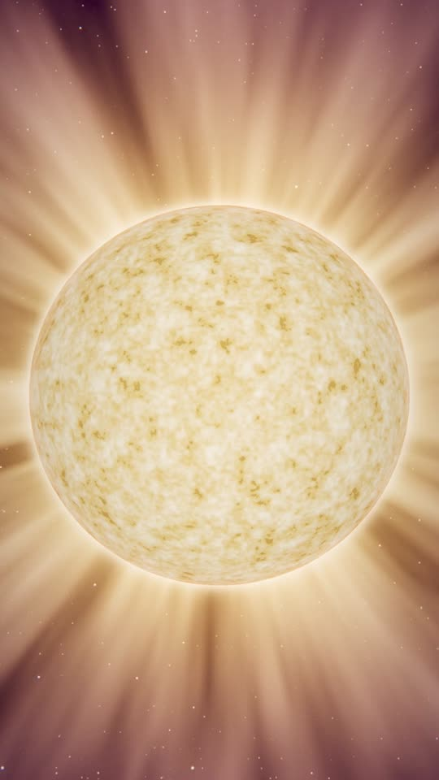
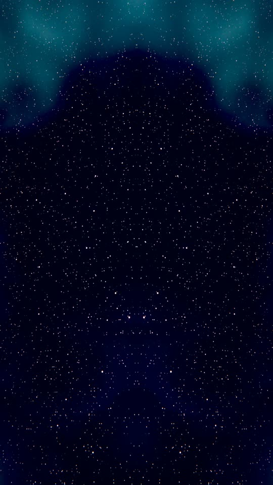

# Space edit — *singularity.wav* (VUTRA)

A vertical (1080×1920, 30 fps) space edit cut to the track. Everything on screen is
generated by a small raymarcher in `src/render.c` — no stock footage, no video assets.
Every cut, flash, zoom punch and flare is driven by the measured beat grid of the audio.

<p align="center">     </p>

## Timing: cut on the transients, not on a grid

The first two versions placed every cut on a fitted constant-tempo grid
(113.31 BPM, `tools/analyze_audio.py`). The grid itself is accurate — it matches
the tracked beats to within 32 ms over the whole track — and the edit still felt
off the beat. Measuring the audio at 2.9 ms resolution (`tools/transients.py`,
hop 128 at 44.1 kHz, each attack refined to its 50 % rise point) shows why:

| grid | median distance of the 291 real attacks | share more than 30 ms off |
|------|------------------------------------------|---------------------------|
| 1/1 beat | **153 ms** | **79 %** |
| 1/2 beat | 70 ms | 73 % |
| 1/3 beat (triplet) | 24 ms | 37 % |
| 1/6 beat | 19 ms | 18 % |

The track grooves in triplets and sixths. A straight beat grid is mathematically
correct and musically wrong here — four out of five hits have nothing on the
beat position the grid picked.

So the timing source is now the measured attacks themselves
(`analysis/transients.json`), with no quantisation anywhere in the chain. Cuts
are selected greedily from that list per section (minimum gap 0.16 s in the
finale up to 0.68 s in the breakdown, biggest hits always get their own cut),
and every slam, glitch, whip, flash and ramp hangs on an attack too. The only
rounding is to the video frame, and a cut always lands on the frame that
*contains* the attack, so the picture never changes late.

Measured on the finished file: 188 picture changes, **median 20.6 ms from the
nearest attack** (one frame is 33 ms, so that is the quantisation floor), 85 %
within a single frame. The same cuts sit a median of 138 ms away from the old
rigid beat grid — that difference is the whole complaint.

`tools/analyze_audio.py` still runs and still supplies the section map: the
per-bar band energy is what locates the drop (12.77 s), the breakdown (36.07 s),
the filtered section (63.60 s) and the finale (69.96 s). Those boundaries are
then snapped onto the nearest strong attack.

## Six subjects, not six angles

A cut that only changes the angle on the same object does not read as a cut. The
renderer carries six subjects and the planner never plays the same one twice in
a row (176 shots, 0 repeats):

| subject | shots | what it is |
|---------|-------|------------|
| black hole | 52 | Schwarzschild geodesics, lensed sky, accretion disk, photon ring |
| ringed planet | 36 | gas giant, banded fbm surface, three palettes, ring system with Cassini gaps, mutual shadowing |
| star | 30 | granulated photosphere, limb darkening, four spectral classes, streamered corona |
| warp | 24 | screen-space accelerating streaks over the lensed star field |
| nebula | 21 | volumetric fly-through, 44 steps of emission/absorption |
| singularity | 13 | log-polar filament tunnel |

Camera setups step through size and elevation archetypes with the azimuth
advancing by the golden angle, and planets, stars and nebulae draw a fresh seed
per shot, so each cut shows a different body rather than the same one again.

## Moves

| move | trigger | what happens |
|------|---------|--------------|
| slam | 47 low-band attacks above the median | zoom step, shake, radial smear, flare |
| glitch | 81 high-band attacks in the top third | 2 frames of slice tear + RGB split |
| flash | the 35 strongest attacks | white-out, decaying over 6 frames |
| stutter | runs of 3 attacks inside 320 ms | shot alternates with the next every 2 frames |
| whip | each section change | 4 frames of rotational smear into the flash |
| speed ramp | drop, main, finale | scene clock 0.18x for 10 frames, then 2.6x |
| freeze | the beat the track drops out (35.4 s) | scene clock to 0, fade toward black |
| invert / mirror | 5 strongest hits, 3 passages | negative frames, mirrored or quad-folded frame |

The scene clock is separate from the timeline clock, so ramps and freezes reach
disk rotation, star granulation, streaks and tunnel scroll, not just the camera.

## How the pictures are made

`src/render.c` (C99 + OpenMP, ~700 lines) renders three scenes:

* **black hole** — null geodesics integrated in Cartesian coordinates with velocity
  Verlet, `d²x/dλ² = −3/2 h² x/|x|⁵` (Schwarzschild, rs = 1). That yields the lensed
  background, the photon ring and the disk arcing over and under the shadow for free.
  The accretion disk is a ridged-multifractal gas sheet with Keplerian shear, relativistic
  Doppler beaming (bright, blue-shifted approaching side), gravitational redshift dimming
  and a slab-thickness term for grazing rays. Optional polar jets are accumulated along
  the ray.
* **warp** — screen-space accelerating light streaks over the real (lensed) star field.
* **singularity** — a log-polar ridged filament tunnel with voids and converging rays.

Shared: a procedural star field on a cube-face grid with analytic anti-aliasing and
per-star colour temperature, a domain-warped 3D fbm nebula, then bloom and a single
resampling pass that fuses zoom, radial blur, **rotational smear (whip cuts)**,
chromatic aberration, **horizontal slice tear (glitch)** and **mirror/quad folding**,
followed by ACES tonemap, split-tone grade, vignette, luminance-weighted grain, the
title overlays, colour inversion and fade.

## Output

| file | what |
|------|------|
| `out/space-edit.mp4` | the edit, 1080×1920, 30 fps, 86.3 s, H.264 CRF 29 + AAC 256k (72 MB, sized to fit in git) |
| `out/master-parts/*.bin` | the CRF 23 master (146 MB, 13.5 Mbit/s), split in two because GitHub rejects files over 100 MB — join per `out/master-parts/README.md`, md5 `c7c96a1e946ff8cd46a34579b10c92b2` |

Checks on the encoded file: 188 picture changes, median 20.6 ms from the nearest
measured attack, 85 % within one frame. The darkest frames in the whole video are
the single beat the track drops out for before the breakdown.

## Rebuild

```bash
sudo apt-get install -y ffmpeg           # ffmpeg + ffprobe
pip3 install numpy scipy pillow
make                                     # builds src/render
ffmpeg -i audio/singularity.mp3 -ac 1 -ar 22050 /tmp/mono.wav
python3 tools/analyze_audio.py /tmp/mono.wav analysis/beatmap.json
ffmpeg -i audio/singularity.mp3 -ac 1 -ar 44100 /tmp/mono44.wav
python3 tools/transients.py /tmp/mono44.wav analysis/transients.json
python3 tools/plan_edit.py analysis/beatmap.json analysis/timeline.csv analysis/edit_plan.md
python3 tools/make_text.py assets
./tools/render_video.sh out/space-edit.mp4 1080 1920
```

`render_video.sh` renders in one pass (~50 min on 4 cores). `tools/render_chunk.sh
<first> <last> <out.mp4>` renders a frame range to a closed-GOP chunk instead, so a
long render can be done in pieces and concatenated with `-c copy`:

```bash
for i in 0 1 2 3 4 5 6 7; do
  ./tools/render_chunk.sh $((i*350)) $((i*350+349)) out/chunks/c$i.mp4
done
ls out/chunks/c*.mp4 | sed "s|.*/|file '|; s|$|'|" > out/chunks/list.txt
ffmpeg -f concat -safe 0 -i out/chunks/list.txt -i audio/singularity.mp3 \
  -map 0:v -map 1:a -c:v copy -c:a aac -b:a 256k -shortest out/space-edit.mp4
```

`tools/preview.sh <timeline.csv> <outdir> [W H] [texlist]` renders any timeline (or a
subsampled copy of it) to PNGs for quick look-development.

## Layout

```
audio/singularity.mp3     the track
src/render.c              renderer (scenes + post pipeline)
tools/analyze_audio.py    tempo + section analysis           -> analysis/beatmap.json
tools/transients.py       2.9 ms transient detection         -> analysis/transients.json
tools/plan_edit.py        shot list + per-frame parameters   -> analysis/timeline.csv
tools/make_text.py        title cards                        -> assets/*.raw
tools/render_video.sh     full render + audio mux
tools/preview.sh          still previews
analysis/edit_plan.md     the shot list, generated
out/space-edit.mp4        the edit
docs/still_*.jpg          frames from the render
```

The track is © VUTRA; it is in this repo only so the edit can be rebuilt.
