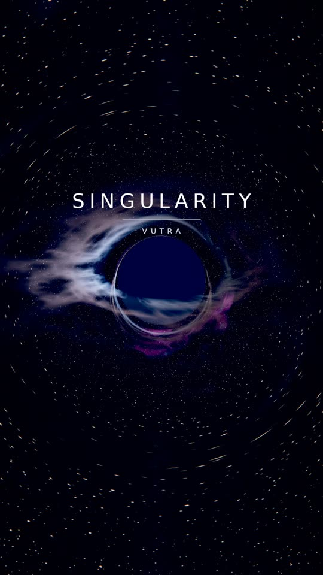
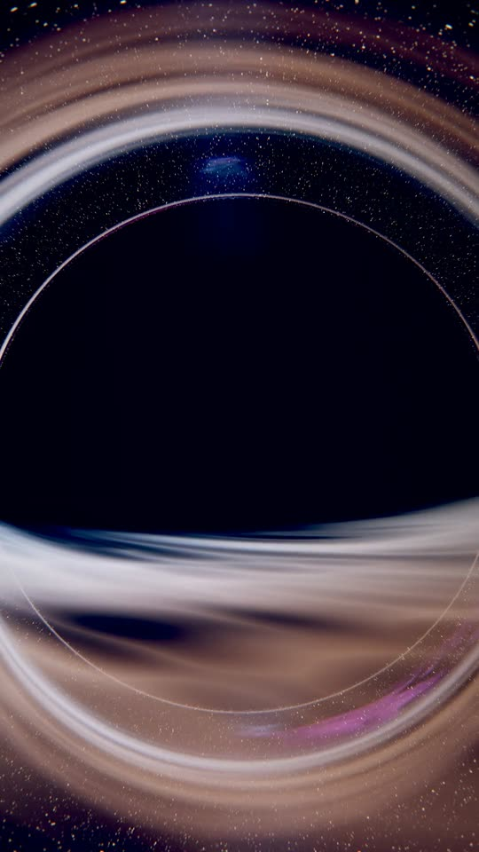
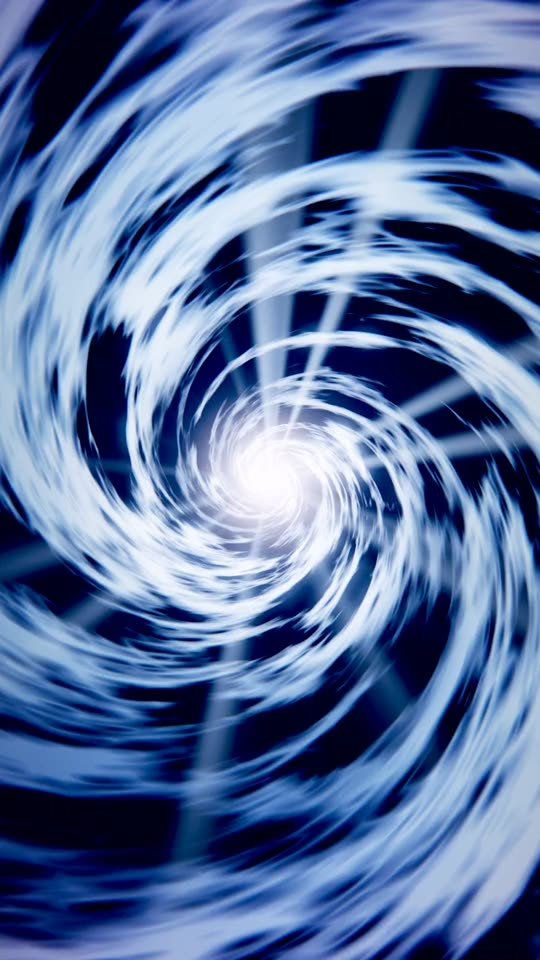

# Space edit — *singularity.wav* (VUTRA)

A vertical (1080×1920, 30 fps) space edit cut to the track. Everything on screen is
generated by a small raymarcher in `src/render.c` — no stock footage, no video assets.
Every cut, flash, zoom punch and flare is driven by the measured beat grid of the audio.

<p align="center">   </p>

## What the audio analysis found

`tools/analyze_audio.py` (numpy + scipy only, no librosa) runs:

| step | method | result |
|------|--------|--------|
| onset envelope | spectral flux per band, local-mean subtracted | 86.1 fps envelope, separate low/high band |
| tempo | autocorrelation + comb scoring over 60–200 BPM | 113.3 BPM |
| beat tracking | Ellis dynamic-programming tracker + forward extension | 163 beats |
| tempo lock | least-squares fit of a constant grid to the tracked beats | period 529.5 ms, max residual 32 ms |
| downbeat phase | the beats with the largest two-bar energy step vote for their phase | bar lines on beat k ≡ 0 (mod 4) |
| structure | self-similarity novelty (checkerboard kernel) + per-bar band energy | 9 sections |

The phase vote matters: this track has a half-time feel, so both beat 1 and beat 3 carry
a kick and a plain kick-energy vote picks the wrong phase (it did — the first version of
the edit was two beats out). Voting with the *arrangement changes* instead puts every
section boundary exactly on a bar line:

```
bar  6  12.77s  drop
bar 11  23.36s  hats enter
bar 17  36.07s  breakdown   (the track drops out for the single beat before it)
bar 20  42.42s  full return
bar 24  50.89s  peak bar
bar 30  63.60s  bass filtered out
bar 33  69.96s  bass returns
bar 40  84.78s  final bar
```

## How the edit is driven

`tools/plan_edit.py` turns the beat map into one row of render parameters per frame
(`analysis/timeline.csv`, 40 floats × 2588 frames) and a readable shot list
(`analysis/edit_plan.md`, 37 shots):

* **cuts** are placed on bar lines (max deviation from a beat: 0.1 ms, i.e. below the
  16.7 ms frame quantisation); shots marked `micro` additionally step the orbit every
  second beat, which doubles the cut rate in the hottest bars
* **zoom punch, camera shake, radial smear, chroma split, disk flare and jet flare**
  all decay exponentially (τ ≈ 105 ms) from every beat, with the amplitude taken from
  that beat's measured low-band onset strength — weak off-beats punch weakly by themselves
* **flashes** sit on the section boundaries listed above
* **framing** is specified as "shadow covers X % of the frame height"; the field of view
  is derived from the camera distance, so the apparent size of the hole is art-directed
  rather than accidental, and the disk exposure is compensated for distance

## How the pictures are made

`src/render.c` (C99 + OpenMP, ~700 lines) renders three scenes:

* **black hole** — null geodesics integrated in Cartesian coordinates with velocity
  Verlet, `d²x/dλ² = −3/2 h² x/|x|⁵` (Schwarzschild, rs = 1). That yields the lensed
  background, the photon ring and the disk arcing over and under the shadow for free.
  The accretion disk is a ridged-multifractal gas sheet with Keplerian shear, relativistic
  Doppler beaming (bright, blue-shifted approaching side), gravitational redshift dimming
  and a slab-thickness term for grazing rays. Optional polar jets are accumulated along
  the ray.
* **warp** — screen-space accelerating light streaks over the real (lensed) star field.
* **singularity** — a log-polar ridged filament tunnel with voids and converging rays.

Shared: a procedural star field on a cube-face grid with analytic anti-aliasing and
per-star colour temperature, a domain-warped 3D fbm nebula, then bloom, radial zoom
blur + chromatic aberration in one resampling pass, ACES tonemap, split-tone grade,
vignette, grain and the title overlays.

## Output

| file | what |
|------|------|
| `out/space-edit.mp4` | the edit, 1080×1920, 30 fps, 86.3 s, H.264 CRF 29 + AAC 256k (79 MB, sized to fit in git) |
| `out/master-parts/*.bin` | the CRF 23 master (164 MB, 15.2 Mbit/s), split in two because GitHub rejects files over 100 MB — join per `out/master-parts/README.md`, md5 `b38c4cc1eeee846ca0a0929d38220b4e` |

Sync check on the encoded file: the 16 largest frame-to-frame brightness jumps all
land 0.7–32.5 ms after a beat of the grid (one frame is 33 ms, so that is the
quantisation and nothing else), and the darkest frames in the whole video are
35.57–35.77 s — the single beat the track drops out for before the breakdown.

## Rebuild

```bash
sudo apt-get install -y ffmpeg           # ffmpeg + ffprobe
pip3 install numpy scipy pillow
make                                     # builds src/render
ffmpeg -i audio/singularity.mp3 -ac 1 -ar 22050 /tmp/mono.wav
python3 tools/analyze_audio.py /tmp/mono.wav analysis/beatmap.json
python3 tools/plan_edit.py analysis/beatmap.json analysis/timeline.csv analysis/edit_plan.md
python3 tools/make_text.py assets
./tools/render_video.sh out/space-edit.mp4 1080 1920
```

`render_video.sh` renders in one pass (~50 min on 4 cores). `tools/render_chunk.sh
<first> <last> <out.mp4>` renders a frame range to a closed-GOP chunk instead, so a
long render can be done in pieces and concatenated with `-c copy`:

```bash
for i in 0 1 2 3 4 5 6 7; do
  ./tools/render_chunk.sh $((i*350)) $((i*350+349)) out/chunks/c$i.mp4
done
ls out/chunks/c*.mp4 | sed "s|.*/|file '|; s|$|'|" > out/chunks/list.txt
ffmpeg -f concat -safe 0 -i out/chunks/list.txt -i audio/singularity.mp3 \
  -map 0:v -map 1:a -c:v copy -c:a aac -b:a 256k -shortest out/space-edit.mp4
```

`tools/preview.sh <timeline.csv> <outdir> [W H] [texlist]` renders any timeline (or a
subsampled copy of it) to PNGs for quick look-development.

## Layout

```
audio/singularity.mp3     the track
src/render.c              renderer (scenes + post pipeline)
tools/analyze_audio.py    beat / tempo / structure analysis  -> analysis/beatmap.json
tools/plan_edit.py        shot list + per-frame parameters   -> analysis/timeline.csv
tools/make_text.py        title cards                        -> assets/*.raw
tools/render_video.sh     full render + audio mux
tools/preview.sh          still previews
analysis/edit_plan.md     the shot list, generated
out/space-edit.mp4        the edit
docs/still_*.jpg          frames from the render
```

The track is © VUTRA; it is in this repo only so the edit can be rebuilt.
